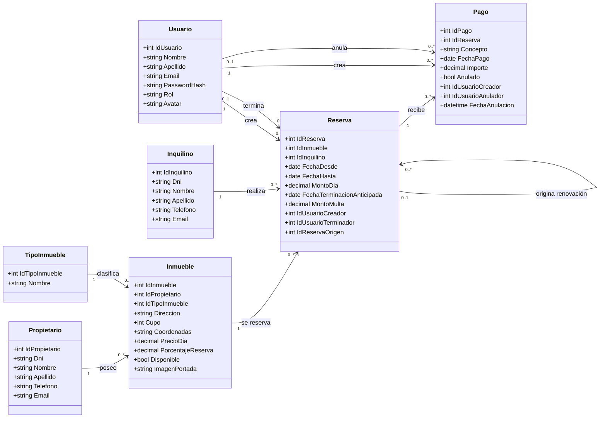

# Inmobiliaria JM

> Sitio web desarrollado con ASP.NET Core MVC para gestionar reservas temporales, sus pagos y las principales entidades de una inmobiliaria.

---

## Integrantes del Grupo

* **Jonathan Muñoz** - *jonathanezequielm20@gmail.com* - [@Praetoryan1](https://github.com/Praetoryan1) - Discord: `No informado`

---

## Modelado de Datos

El modelo separa a propietarios e inquilinos y relaciona las demás entidades de la siguiente manera:

* Un propietario puede tener muchos inmuebles.
* Un tipo de inmueble puede clasificar muchos inmuebles.
* Un inmueble puede aparecer en muchas reservas, siempre que sus fechas no se superpongan.
* Un inquilino puede realizar muchas reservas.
* Una reserva puede tener muchos pagos.
* Cada pago registra el usuario que lo creó y, si fue anulado, el administrador que realizó la anulación.

### Diagrama Entidad-Relación (DER) / Diagrama de Clases

<details>
<summary>Ver diagrama en código Mermaid</summary>



</details>

---

## Estado Actual del Proyecto

Esta versión contiene:

* ABM y vista de detalles de propietarios, inquilinos y tipos de inmueble.
* ABM y vista de detalles de inmuebles, con propietario, tipo, disponibilidad e imagen de portada.
* ABM y vista de detalles de reservas, relacionadas con un inmueble y un inquilino.
* Acceso mediante email y contraseña, con roles Administrador y Empleado.
* Gestión administrativa de usuarios y edición del perfil propio.
* Registro y consulta de pagos desde cada reserva.
* Edición limitada al concepto del pago, conservando su fecha e importe originales.
* Anulación lógica de pagos, sin eliminarlos del historial.
* Auditoría del usuario creador y del administrador que anuló cada pago.
* Terminación anticipada con cálculo del 50% o 25% del alquiler restante.
* Registro obligatorio y atómico del pago de la multa al terminar una reserva.
* Auditoría del usuario que creó y del usuario que terminó cada reserva.
* Renovación mediante una nueva reserva con el mismo inmueble e inquilino.
* Validación de disponibilidad y vínculo con la reserva de origen.
* Porcentaje de pago inicial configurable para cada inmueble.
* Creación atómica de la reserva y de su pago inicial obligatorio.
* Búsquedas y listados paginados con un máximo de 10 registros por página.
* Filtro de inmuebles por disponibilidad y filtro de reservas por estado.
* Validaciones en el navegador y en el servidor.
* Control de fechas y prevención de reservas superpuestas para un mismo inmueble.
* Persistencia en MySQL/MariaDB mediante consultas parametrizadas.

Las imágenes adicionales e informes se incorporarán en los siguientes incrementos de la entrega final.

---

## Tecnologías

* ASP.NET Core MVC sobre .NET 10.
* C#.
* MySQL/MariaDB.
* `MySql.Data` 26.7.0.
* Bootstrap 5.
* XAMPP como entorno local recomendado.

---

## Requisitos Previos

Antes de ejecutar el proyecto se necesita:

1. [.NET SDK 10](https://dotnet.microsoft.com/download/dotnet/10.0) o una versión compatible.
2. [XAMPP](https://www.apachefriends.org/) con el módulo MySQL/MariaDB, o una instalación equivalente de MySQL.
3. Git, únicamente si se clonará el repositorio desde GitHub.

Se puede comprobar la instalación de .NET con:

```powershell
dotnet --version
```

---

## Obtener el Proyecto

```powershell
git clone https://github.com/Praetoryan1/Inmobiliaria_JM.git
cd Inmobiliaria_JM
dotnet restore
```

---

## Crear e Inicializar la Base de Datos

El archivo [`DataBase/inmobiliaria_jm.sql`](DataBase/inmobiliaria_jm.sql) crea la base `inmobiliaria_jm`, sus siete tablas y datos iniciales para comprobar los ABM.

### Opción 1: importar con phpMyAdmin

1. Abrir el panel de control de XAMPP.
2. Iniciar los módulos **Apache** y **MySQL**.
3. Presionar **Admin** junto al módulo MySQL para abrir phpMyAdmin.
4. Seleccionar la pestaña **Importar**.
5. Elegir el archivo `DataBase/inmobiliaria_jm.sql` del proyecto.
6. Mantener el formato SQL y presionar **Continuar**.
7. Verificar que la base `inmobiliaria_jm` contenga las tablas `Propietarios`, `Inquilinos`, `Usuarios`, `TiposInmueble`, `Inmuebles`, `Reservas` y `Pagos`.

### Opción 2: importar desde PowerShell

Con XAMPP instalado en `C:\xampp` y MySQL iniciado, ejecutar desde la raíz del proyecto:

```powershell
Get-Content .\DataBase\inmobiliaria_jm.sql -Raw |
    & C:\xampp\mysql\bin\mysql.exe --user=root --default-character-set=utf8mb4
```

El script puede ejecutarse nuevamente sin duplicar los datos iniciales, porque utiliza comprobaciones de existencia antes de insertar.

---

## Configurar la Conexión

La conexión local predeterminada se encuentra en [`appsettings.json`](appsettings.json):

```text
Server=localhost;Port=3306;Database=inmobiliaria_jm;User ID=root;Password=;SslMode=Disabled;
```

Esta configuración corresponde a XAMPP con el usuario `root`, sin contraseña y el puerto `3306`. Si la instalación utiliza otra contraseña, usuario o puerto, se debe actualizar `ConnectionStrings:DefaultConnection` antes de ejecutar la aplicación.

---

## Ejecutar la Aplicación

1. Iniciar **MySQL** desde el panel de XAMPP. Apache no es necesario para ejecutar ASP.NET, salvo que se quiera usar phpMyAdmin.
2. Abrir PowerShell en la raíz del repositorio.
3. Ejecutar:

```powershell
dotnet restore
dotnet build
dotnet run --launch-profile http
```

4. Abrir en el navegador:

```text
http://localhost:5192
```

Para el primer ingreso se crea el siguiente administrador:

```text
Email: admin@inmobiliaria.com
Contraseña: Admin123!
```

Rutas principales:

* `/Propietarios`
* `/Inquilinos`
* `/TiposInmuebles`
* `/Inmuebles`
* `/Reservas`
* `/Usuarios/Perfil`
* `/Usuarios` para administradores

Los pagos se abren desde el listado o el detalle de una reserva.

Para detener la aplicación, presionar `Ctrl+C` en la consola.

Si se prefiere HTTPS y el certificado local todavía no está configurado:

```powershell
dotnet dev-certs https --trust
dotnet run --launch-profile https
```

La dirección HTTPS configurada es `https://localhost:7048`.

---

## Estructura Principal

```text
Controllers/     Controladores MVC de las entidades y la autenticación
DataBase/        Script de creación e inicialización de MySQL
Models/          Entidades, relaciones y validaciones
Repositories/    Acceso a datos mediante MySql.Data
Views/           Vistas Razor de los ABM y sus detalles
wwwroot/         CSS, JavaScript, archivos estáticos e imágenes cargadas
```
