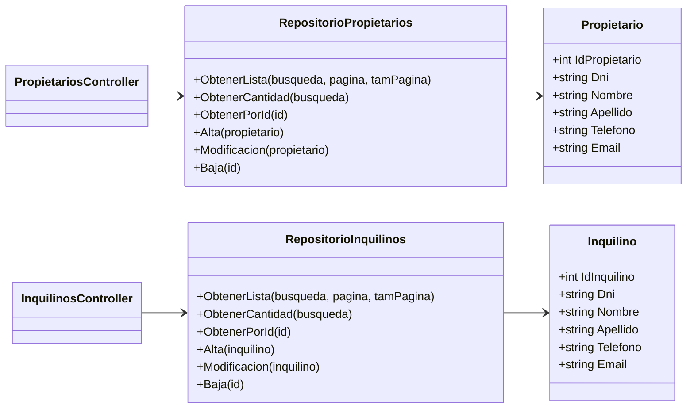

# Inmobiliaria JM

Sitio web desarrollado con ASP.NET Core MVC para administrar la información de una inmobiliaria. Esta versión corresponde a la **primera entrega** y contiene el ABM completo de propietarios e inquilinos.

## Integrante

- Jonathan Muñoz

## Alcance de la primera entrega

- Alta, consulta, modificación y baja de propietarios.
- Alta, consulta, modificación y baja de inquilinos.
- Búsqueda por DNI, nombre, apellido, teléfono o email.
- Listados paginados con un máximo de 10 registros por página.
- Validaciones tanto en el navegador como en el servidor.
- Persistencia en MySQL/MariaDB mediante consultas parametrizadas.

Las entidades restantes del proyecto general —inmuebles, reservas, pagos y usuarios— se incorporarán en entregas posteriores.

## Tecnologías

- ASP.NET Core MVC sobre .NET 10.
- C#.
- MySQL/MariaDB.
- `MySql.Data` 26.7.0.
- Bootstrap 5.
- XAMPP como entorno local recomendado.

## Diagrama de clases

El siguiente diagrama representa el recorte del modelo correspondiente a esta primera entrega. Propietario e Inquilino son entidades independientes, de acuerdo con el UML general del proyecto.



## Requisitos previos

Antes de ejecutar el proyecto se necesita:

1. [.NET SDK 10](https://dotnet.microsoft.com/download/dotnet/10.0) o una versión compatible.
2. [XAMPP](https://www.apachefriends.org/) con el módulo MySQL/MariaDB, o una instalación equivalente de MySQL.
3. Git, únicamente si se clonará el repositorio desde GitHub.

Se puede comprobar la instalación de .NET con:

```powershell
dotnet --version
```

## Obtener el proyecto

```powershell
git clone https://github.com/Praetoryan1/Inmobiliaria_JM.git
cd Inmobiliaria_JM
dotnet restore
```

## Crear e inicializar la base de datos

El archivo [`DataBase/inmobiliaria_jm.sql`](DataBase/inmobiliaria_jm.sql) crea la base `inmobiliaria_jm`, las tablas `Propietarios` e `Inquilinos` y registros iniciales para probar los ABM.

### Opción 1: importar con phpMyAdmin

1. Abrir el panel de control de XAMPP.
2. Iniciar los módulos **Apache** y **MySQL**.
3. Presionar **Admin** junto al módulo MySQL para abrir phpMyAdmin.
4. Seleccionar la pestaña **Importar**.
5. Elegir el archivo `DataBase/inmobiliaria_jm.sql` del proyecto.
6. Mantener el formato SQL y presionar **Continuar**.
7. Verificar que aparezca la base `inmobiliaria_jm` con las tablas `propietarios` e `inquilinos`.

### Opción 2: importar desde PowerShell

Con XAMPP instalado en `C:\xampp` y MySQL iniciado, ejecutar desde la raíz del proyecto:

```powershell
Get-Content .\DataBase\inmobiliaria_jm.sql -Raw |
    & C:\xampp\mysql\bin\mysql.exe --user=root --default-character-set=utf8mb4
```

El script puede ejecutarse nuevamente sin duplicar los datos iniciales, porque utiliza `CREATE ... IF NOT EXISTS` e `INSERT IGNORE`.

## Configurar la conexión

La conexión local predeterminada se encuentra en [`appsettings.json`](appsettings.json):

```text
Server=localhost;Port=3306;Database=inmobiliaria_jm;User ID=root;Password=;SslMode=Disabled;
```

Esta configuración corresponde a XAMPP con el usuario `root`, sin contraseña y el puerto `3306`. Si la instalación utiliza otra contraseña, usuario o puerto, se debe actualizar `ConnectionStrings:DefaultConnection` antes de ejecutar la aplicación.

## Ejecutar la aplicación

Desde la raíz del repositorio:

```powershell
dotnet restore
dotnet build
dotnet run
```

La consola indicará la dirección local. Con la configuración incluida, normalmente estará disponible en:

- `http://localhost:5192`
- `https://localhost:7048`

Rutas principales:

- `/Propietarios`
- `/Inquilinos`

Si el certificado HTTPS local no está configurado, se puede preparar con:

```powershell
dotnet dev-certs https --trust
```

## Estructura principal

```text
Controllers/     Controladores MVC de propietarios e inquilinos
DataBase/        Script de creación e inicialización de MySQL
Models/          Entidades y validaciones
Repositories/    Acceso a datos mediante MySql.Data
Views/           Vistas Razor de los ABM
wwwroot/         CSS, JavaScript y dependencias web estáticas
```
